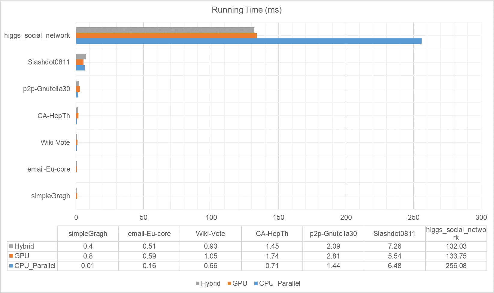
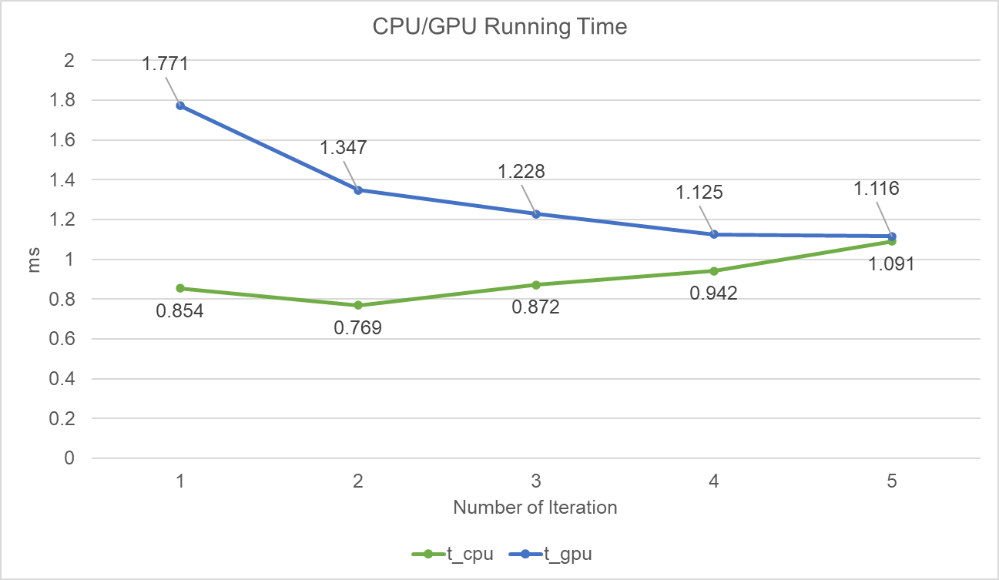

# SSSP_On_CUDA

---

Implement Single-Source Shortest Paths (SSSP) on CPU, GPU (CUDA), and Hybrid (CPU-GPU)

---

<!-- TOC -->

- [SSSP_On_CUDA](#sssponcuda)
  - [Instruction](#instruction)
  - [Description](#description)
    - [Implementation on CPU](#implementation-on-cpu)
    - [Implementation of GPU](#implementation-of-gpu)
    - [Implementation of Hybrid (CPU - GPU)](#implementation-of-hybrid-cpu---gpu)
  - [Running Application](#running-application)
      - [Application Argument](#application-argument)
  - [Input Graph Format](#input-graph-format)
  - [Performance](#performance)
    - [Datasets](#datasets)
    - [Running Time on graph datasets](#running-time-on-graph-datasets)
  - [Known issues](#known-issues)
  - [Optimization](#optimization)

<!-- /TOC -->

## Instruction

**Note:** Before run `make`, if **in Linux** please modify the `OPENMPFLAGS=-Xcompiler -openmp` to `OPENMPFLAGS=-Xcompiler -fopenmp` in `Makefile`. **In Windows**, no need to make modification.

Run `make` in the root folder to generate the executable file.

The core algorithm of this project is **Bellman-Ford Algorithm**.

## Description

### Implementation on CPU

1. Loop all edges to update vertexs' distance to source node.
2. Repeate *Step 1* until there is no vertex needs to update its distance to source.

### Implementation of GPU

1. Divide all edges into multiple parts.
2. Launch multiple threads to process the edges assigned from *Step 1*.
3. Repeate *Step 1* and *Step 2* until there is no vertex needs to update its distance to source.
Basic implementation of dijkstra algorithm on GPU.

### Implementation of Hybrid (CPU - GPU)

1. Use `openmp.exe (In Windows)` or `openmp (In Linux)` to run the hybrid one.

## Running Application

```shell
$ ./sssp --input path_of_graph
$ ./openmp --input path_of_graph 
```

for `openmp` it will run hybrid implementation and GPU-only's implementation. You also can specify argument *--oncpu true* to run a CPU-only parallel implementation (OpenMP).


#### Application Argument

```
Optional arguments:
  [--oncpu]: Run this graph on CPU. Its value must be true/false (default: false). E.g., --oncpu true
  [--source]: Set the source node (default: minimum node number). E.g., --source 0  
```

## Input Graph Format

Input graphs should be in form of plain text files. The format of each edge is as following:

```
source end weight
```

if the weight is not specified, it will be assigned to a default value: **1**.


## Performance 

### Datasets 

| Datasets  | Nodes | Edges | Diameter |
| --                    | --:       | --:         | --: |
| simpleGraph           | 9         | 11          | 4   | 
| email-Eu-core         | 1,005     | 25,571      | 7   |
| Wiki-Vote             | 8,298     | 103,689     | 7   |
| CA-HepTh              | 9,877     | 25,998      | 17  |
| p2p-Gnutella30        | 36,682    | 88,328      | 10  |
| Slashdot0811          | 77,350    | 516,575     | 11  |
| higgs_social_network  | 456,626   | 14,855,842  | 9   |
| roadNet-PA            | 1,088,092 | 1,541,898   | 786 |

### Running Time on graph datasets




**How load balancing works in hybrid**



---

## Known issues

- [x] Improve the speed of loading graph
- [ ] Setting size of message -- Size is not correct


---

## Optimization

- [ ] bottleneck: data transferring between host and device
- [ ] apporach the ideal split ratio faster